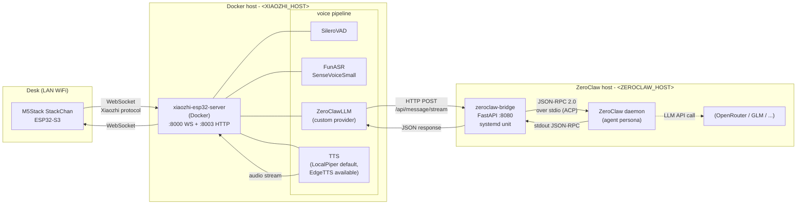
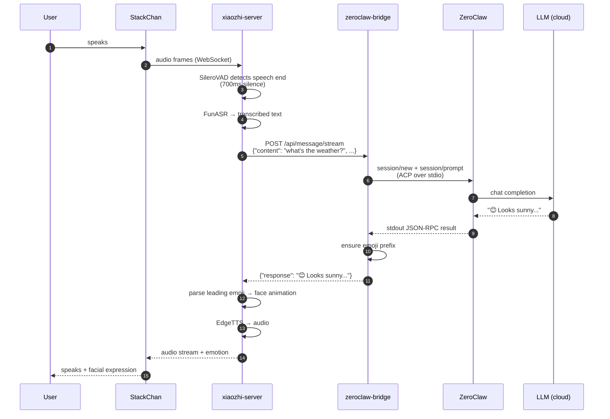

<p align="center">
  
</p>

# Dotty

**Your self-hosted [StackChan](https://github.com/m5stack/StackChan) robot assistant -- kid-safe by default, hackable by design, private by architecture.**

Dotty is a fully self-hosted voice stack for the M5Stack StackChan desktop robot. Open-source firmware on the device, [xiaozhi-esp32-server](https://github.com/xinnan-tech/xiaozhi-esp32-server) for voice I/O, and a small FastAPI bridge to whatever LLM agent you want as the brain. ASR, TTS, session state, and persona all run on your own hardware. The LLM is pluggable -- the reference config uses OpenRouter, but swap in Ollama for fully offline operation with no code changes.

Out of the box, Dotty ships in **Kid Mode** -- age-appropriate language, safety guardrails, and content filtering are on by default. Disable Kid Mode for a general-purpose assistant. The default persona is named "Dotty" (rename it during `make setup`).

> **v0.1 - early-feedback release.** Dotty works end-to-end on the maintainer's hardware. This first tagged release is to invite real-world feedback before v1.0 polish. **Known issues:** face emoji rendering is missing visual differentiation for 4 of 9 emotions (sad / surprise / love / laughing); sound-direction localizer has a hardware-AEC-related left-bias on M5Stack CoreS3 (energy detection works, direction is unreliable); kid-voice ASR accuracy on SenseVoice has a kid-speech gap that whisper.cpp will close in a follow-up. Full backlog in `tasks.md` (private). Bugs, PRs, and "this didn't work for me" issues all very welcome.

## Why I built this

I didn't like the idea of a camera and microphone running in my house unless I could (1) self-host the whole stack end-to-end and (2) understand the whole stack end-to-end. Off-the-shelf voice assistants fail both tests - audio leaves the house, the model is opaque, and you're trusting a vendor's privacy posture forever.

So Dotty is the version that passes: every component runs on hardware I own, every seam is documented and swappable, and the only thing that can leave the LAN is whatever LLM call I explicitly route out (and even that swaps to a local model with a config change). It's also meant to be fun - a friendly desktop robot for the kids, and an interesting hobby project to keep building on.

## Features

- **Kid Mode (on by default)** -- age-appropriate responses, content filtering, and safety guardrails. Toggle off for general-purpose use. See [`docs/child-safety.md`](./docs/child-safety.md).
- **Local ASR** -- FunASR SenseVoiceSmall runs on your hardware, no cloud transcription.
- **Local or cloud TTS** -- Piper (offline) or EdgeTTS (cloud). Swap with a config change.
- **Streaming responses** -- the bridge streams LLM output to the voice pipeline for lower perceived latency.
- **Emoji expressions** -- every response starts with an emoji that the firmware maps to a face animation (smile, laugh, sad, surprise, thinking, angry, love, sleepy, neutral).
- **MCP tools** -- ZeroClaw exposes tools (web search, memory, etc.) to the LLM via the Model Context Protocol.
- **States, toggles & LEDs** -- a six-state mutex (`idle / talk / story_time / security / sleep / dance`) plus orthogonal toggles (`kid_mode`, `smart_mode`) drive both behaviour and the 12-pixel LED ring. State pip on left ring index 0, toggle pips on right ring 8/9, privacy LEDs hardware-protected at 6/11. Voice phrases, camera edges, and dashboard controls all flow through the same firmware StateManager. See [`docs/modes.md`](./docs/modes.md) for the full contract + transition diagram.
- **Vision (camera)** -- the StackChan's built-in camera can capture images for multimodal LLM queries.
- **Persona system** -- swappable persona prompts in `personas/`. Change the robot's personality without touching code.
- **Calendar context** -- optional calendar integration feeds upcoming events into the conversation context.
- **Hackable** -- every seam is swappable: LLM, TTS, ASR, agent framework, persona. Fork it, rip out what you don't want, wire in your own.

## States, Toggles & LEDs

Dotty's behaviour is structured as a **six-state mutex** plus **two orthogonal toggles**, all owned by the firmware StateManager (`firmware/main/stackchan/modes/state_manager.cpp`). It's the architectural backbone — voice phrases, camera edges, dashboard controls, and every behavioural side-effect plug into the same model.

**States** (mutually exclusive, exactly one active):

| State | LED arc (left ring 0-5) | What's happening |
|---|---|---|
| `idle` | off | Default. Ambient awareness, gentle idle motion. |
| `talk` | dim green `(0,60,0)` | Conversation engaged. The listening pixel on the right ring lights red while the user has the turn; thinking/speaking are face-animation only. |
| `story_time` | warm `(100,40,0)` | Long-running interactive story. Bypasses ZeroClaw, calls OpenRouter directly with story persona + rolling context. |
| `security` | white `(80,80,80)` flashing 1 Hz across all 6 left pixels | Wide deliberate scan, periodic capture. Greeter suppressed. |
| `sleep` | very dim blue `(0,0,16)` | Servos parked + torque off, sleepy emoji on screen. Wakes on face / voice / head-pet. |
| `dance` | rainbow sweep | Transient performance — choreography + audio. |

**Toggles** (compose freely with state):

| Toggle | LED pip (right ring) | When ON |
|---|---|---|
| `kid_mode` | warm pink `(168,80,100)` at index **8** | Safety-tuned model, content sandwich, camera tools denied, kid-safe persona |
| `smart_mode` | orange `(168,80,0)` at index **9** | Bridge bypasses ZeroClaw → direct OpenRouter (capable model). No memory, no tools. |

**12-pixel LED ring layout** — left ring 0-5 paint the **state arc** (all six pixels show the current state colour), right-ring index **6** is the **listening pixel** (red while the user has the turn), and right-ring indices **8** and **9** are the **toggle pips** (kid_mode and smart_mode). Right-ring indices 7, 10, and 11 are reserved for future indicators (low-battery is a known candidate).

The `idle → talk` transition fires on the firmware `face_detected` event (any face — family member or stranger). The bridge runs a VLM room-view match in parallel and feeds the resulting identity into the voice-channel persona; recognition does not gate the LED transition.

Transitions are voice-driven (`go to sleep`, `tell me a story`, `keep watch`, `wake up`), camera-edge-driven (face_detected → `talk`), or dashboard-driven (`POST /admin/state`). The firmware emits a `state_changed` perception event on every transition; the bridge consumes those events and gates downstream behaviour (e.g. ambient awareness only in `idle`, greeter suppressed in `security`). See [`docs/modes.md`](./docs/modes.md) for the full state + LED contract, transition diagram, and per-state backing-architecture.

---

## Reference deployment

- **Hardware**: M5Stack StackChan (CoreS3 + servo kit), firmware built from `m5stack/StackChan`.
- **Brain**: [ZeroClaw](https://github.com/zeroclaw-labs/zeroclaw) on any host that can run it (a small Linux box, your existing home server, or even the same Docker host), with Mistral Small 3.2 via OpenRouter as the default LLM (Qwen3-30B, Claude, and others are drop-in alternates).
- **Voice I/O**: xiaozhi-esp32-server on Docker (any Linux Docker host; single-host works too).

---

## Deeper reference

This README covers deployment. For what the stack *is* underneath - hardware specs, protocol docs, model facts, and features we aren't using - see [`docs/`](./docs/README.md):

- [docs/architecture.md](./docs/architecture.md) - end-to-end data flow, who talks to who, why this shape.
- [docs/hardware.md](./docs/hardware.md) - M5Stack StackChan body + firmware lineage + on-device MCP tool catalog.
- [docs/voice-pipeline.md](./docs/voice-pipeline.md) - xiaozhi-esp32-server internals, FunASR/SenseVoice, VAD, TTS.
- [docs/brain.md](./docs/brain.md) - ZeroClaw architecture, LLM model details, OpenRouter role.
- [docs/protocols.md](./docs/protocols.md) - Xiaozhi WS framing, MCP-over-WS, ACP JSON-RPC, emotion channel.
- [docs/modes.md](./docs/modes.md) - behavioural mode taxonomy + LED contract + transition diagram.
- [docs/latent-capabilities.md](./docs/latent-capabilities.md) - features upstream supports that we aren't using yet.
- [docs/references.md](./docs/references.md) - canonical upstream URLs, model cards, licenses.

---

## TL;DR - what runs where

| Component | Host | Notes |
|---|---|---|
| StackChan (device) | ESP32-S3 on the desk | Firmware built from `m5stack/StackChan` (see `SETUP.md`) |
| xiaozhi-esp32-server | Docker host (`<XIAOZHI_HOST>`) | Docker, ports 8000 + 8003 |
| zeroclaw-bridge | ZeroClaw host (`<ZEROCLAW_HOST>`) | FastAPI on port 8080, systemd |
| ZeroClaw daemon | ZeroClaw host (`<ZEROCLAW_HOST>`) | `<ZEROCLAW_BIN>` |
| Admin workstation | any LAN box | Development / `ssh` only |

---

## Configuring for your environment

This repo uses placeholders in place of real IPs, usernames, and filesystem paths. Substitute these everywhere before deploying:

| Placeholder | Meaning |
|---|---|
| `<XIAOZHI_HOST>` | LAN IP of the Docker host running xiaozhi-server. StackChan reaches this on WiFi, so it must be a LAN IP, not a Tailscale/VPN IP. |
| `<XIAOZHI_USER>` | SSH user for the Docker host (whatever your distro defaults to: `root`, `ubuntu`, `dietpi`, etc.). |
| `<XIAOZHI_HOSTNAME>` | Hostname or Tailscale name of the Docker host (optional, IP works for everything). |
| `<XIAOZHI_PATH>` | Path on the Docker host where you clone/install xiaozhi-server (e.g. `/opt/xiaozhi-server/` or `/srv/xiaozhi-server/`). |
| `<ZEROCLAW_HOST>` | LAN IP of the host running ZeroClaw + the bridge. Anything that runs the `zeroclaw` binary works (a small Linux box, your existing home server, or the same Docker host as xiaozhi-server). |
| `<ZEROCLAW_USER>` | SSH user on the ZeroClaw host (whatever your distro defaults to). |
| `<ZEROCLAW_HOME>` | Home directory on the ZeroClaw host for the user that owns the bridge (e.g. `/root/` or `/home/<user>/`). |
| `<BRIDGE_PATH>` | Full path to the zeroclaw-bridge working directory (e.g. `/root/zeroclaw-bridge/`). |
| `<ZEROCLAW_BIN>` | Absolute path to the `zeroclaw` binary (cargo default: `~/.cargo/bin/zeroclaw`). |
| `<ZEROCLAW_CFG>` | ZeroClaw config file path (default: `/root/.zeroclaw/config.toml`). |
| `<YOUR_NAME>` | Your name / org, used in the persona prompt in `.config.yaml`. |
| `<ROBOT_NAME>` | Name the robot introduces itself as, referenced in the persona prompt in `.config.yaml`. Any string - pick whatever you want. The default example uses the hardware name ("StackChan"). |

Port numbers (`8000`, `8003`, `8080`, `18789`, `42617`) are product-generic and should not be changed unless you also reconfigure the respective services.

Files you will definitely need to edit before first run:

- `.config.yaml` - replace `<XIAOZHI_HOST>`, `<ZEROCLAW_HOST>`, and customize the `prompt:` block.
- `docker-compose.yml` - set `TZ` to your timezone.
- `zeroclaw-bridge.service` - adjust paths if the bridge doesn't live at `/root/zeroclaw-bridge/`.

---

## High-level architecture



### Why this shape?

- **xiaozhi-server handles audio** (ASR + TTS) because the StackChan firmware already speaks its WebSocket protocol. Minimal firmware work.
- **ZeroClaw is the brain** because it has the tools, memory, channels, and LLM routing already set up. The StackChan is just another way to reach the same agent.
- **A small bridge lives in between** because ZeroClaw's gateway HTTP API only *reads* session state. The bridge talks to ZeroClaw via the Agent Client Protocol (JSON-RPC 2.0 over stdio) against a long-running `zeroclaw acp` child.

---

## Message flow (single user utterance)



Typical end-to-end latency: **~4–5s** per turn, dominated by the LLM call (ASR/TTS are both fast).

---

## Deployment layout

```mermaid
flowchart TB
    subgraph DockerHost_fs["Docker host filesystem - &lt;XIAOZHI_PATH&gt;"]
        direction TB
        UA1["data/.config.yaml<br/>(override - voice, persona, endpoints)"]
        UA2["models/SenseVoiceSmall/<br/>(model.pt + configs)"]
        UA3["custom-providers/zeroclaw/<br/>(zeroclaw.py + __init__.py)"]
        UA3b["custom-providers/edge_stream/<br/>(edge_stream.py + __init__.py)"]
        UA3d["custom-providers/piper_local/<br/>(piper_local.py + __init__.py)"]
        UA3c["custom-providers/asr/fun_local.py<br/>(patched ASR - language key)"]
        UA4["tmp/<br/>(TTS audio scratch)"]
        UA5["repo/<br/>(git clone, reference only)"]
        UA6["docker-compose.yml"]
    end

    subgraph ZCHost_fs["ZeroClaw host filesystem"]
        direction TB
        RA["&lt;BRIDGE_PATH&gt;"]
        RA1["bridge.py"]
        RA2[".venv/<br/>(fastapi + uvicorn)"]
        RB["/etc/systemd/system/<br/>zeroclaw-bridge.service"]
        RC["~/.zeroclaw/<br/>(agent persona config)"]
        RA --> RA1 & RA2
    end
```



Container volume mounts:

| Host path | Container path | Purpose |
|---|---|---|
| `data/.config.yaml` | `/opt/xiaozhi-esp32-server/data/.config.yaml` | Config override (read-only mount) |
| `models/SenseVoiceSmall/` | `/opt/xiaozhi-esp32-server/models/SenseVoiceSmall/` | ASR weights |
| `models/piper/` | `/opt/xiaozhi-esp32-server/models/piper/` | Piper TTS voice models (`.onnx` + `.json`) |
| `tmp/` | `/opt/xiaozhi-esp32-server/tmp/` | Scratch |
| `custom-providers/zeroclaw/` | `/opt/xiaozhi-esp32-server/core/providers/llm/zeroclaw/` | Custom LLM provider (directory mount) |
| `custom-providers/edge_stream/edge_stream.py` | `/opt/xiaozhi-esp32-server/core/providers/tts/edge_stream.py` | Streaming EdgeTTS provider (file mount) |
| `custom-providers/piper_local/piper_local.py` | `/opt/xiaozhi-esp32-server/core/providers/tts/piper_local.py` | Local Piper TTS provider (file mount) |
| `custom-providers/asr/fun_local.py` | `/opt/xiaozhi-esp32-server/core/providers/asr/fun_local.py` | Patched FunASR - adds `language` config key so SenseVoiceSmall can be pinned to English |

---

## Endpoints

| What | URL | Who calls it |
|---|---|---|
| OTA (enter into StackChan settings) | `http://<XIAOZHI_HOST>:8003/xiaozhi/ota/` | StackChan device on boot |
| WebSocket | `ws://<XIAOZHI_HOST>:8000/xiaozhi/v1/` | StackChan device after OTA handshake |
| Bridge (chat) | `http://<ZEROCLAW_HOST>:8080/api/message` | xiaozhi-server's ZeroClawLLM |
| Bridge (health) | `http://<ZEROCLAW_HOST>:8080/health` | Humans, monitoring |
| ZeroClaw gateway | `http://127.0.0.1:42617` (host-local) | ZeroClaw's web UI only |

---

## Reboot survival

Both services restart themselves without manual intervention:

| Host | Mechanism |
|---|---|
| Docker host | Container `restart: unless-stopped` in `docker-compose.yml` + ensure dockerd starts at boot on your distro. |
| ZeroClaw host | `zeroclaw-bridge.service` is `enabled`, `Restart=on-failure`. |

Caveat: if you run `docker compose down`, the container is marked stopped
and won't come back on reboot. Use `docker compose restart` or
`docker restart xiaozhi-esp32-server` for transient restarts instead.

---

## Common ops

```bash
# Tail xiaozhi-server logs (voice pipeline)
ssh <XIAOZHI_USER>@<XIAOZHI_HOST> 'docker logs -f xiaozhi-esp32-server'

# Tail bridge logs
ssh <ZEROCLAW_USER>@<ZEROCLAW_HOST> 'sudo journalctl -u zeroclaw-bridge -f'

# Restart voice pipeline after config change
ssh <XIAOZHI_USER>@<XIAOZHI_HOST> 'cd <XIAOZHI_PATH> && docker compose restart'

# Restart the bridge
ssh <ZEROCLAW_USER>@<ZEROCLAW_HOST> 'sudo systemctl restart zeroclaw-bridge'

# Smoke test full round-trip
curl -X POST http://<ZEROCLAW_HOST>:8080/api/message \
  -H 'content-type: application/json' \
  -d '{"content":"hello","channel":"dotty"}'

# Bridge health
curl http://<ZEROCLAW_HOST>:8080/health
```

### Changing voice
The default TTS is `LocalPiper` (offline, runs inside the container). To change the Piper voice, edit `TTS.LocalPiper.voice` and the corresponding `model_path` / `config_path` in `data/.config.yaml`. To switch to cloud EdgeTTS instead, set `selected_module.TTS: EdgeTTS` and edit `TTS.EdgeTTS.voice` (any Microsoft Edge Neural voice ID works, e.g. `en-US-AvaNeural`). Restart the container after changes.

### Changing persona (the robot's personality)
Primary source: ZeroClaw's own system prompt in `<ZEROCLAW_CFG>` on the ZeroClaw host. The `prompt:` key in `data/.config.yaml` is a secondary hint that the bridge passes to ZeroClaw as context, but ZeroClaw's own prompt wins.

### Changing VAD sensitivity
`VAD.SileroVAD.min_silence_duration_ms` in `data/.config.yaml`. Default: 700ms. Lower = cuts off quicker. Higher = waits longer for slow speakers.

### Changing the LLM model
`default_model` key near the top of `<ZEROCLAW_CFG>` on the ZeroClaw host (provider and encrypted api_key live next to it). ACP mode caches config in the long-running child, so restart the bridge (`sudo systemctl restart zeroclaw-bridge`) after editing. Confirm with `sudo <ZEROCLAW_BIN> status | grep Model`.

---

## File inventory (this repo)

| File | Deployed to | Purpose |
|---|---|---|
| `bridge.py` | ZeroClaw host `<BRIDGE_PATH>/bridge.py` | FastAPI HTTP→ZeroClaw translator (ACP over stdio) |
| `bridge/requirements.txt` | bare-metal venv | Pinned Python deps for the bridge (fastapi, uvicorn, pydantic) |
| `zeroclaw-bridge.service` | ZeroClaw host `/etc/systemd/system/` | systemd unit for bridge |
| `custom-providers/zeroclaw/zeroclaw.py` | Docker host `core/providers/llm/zeroclaw/zeroclaw.py` | xiaozhi LLM provider, proxies to the ZeroClaw bridge |
| `custom-providers/zeroclaw/__init__.py` | Docker host `core/providers/llm/zeroclaw/__init__.py` | Python package marker |
| `custom-providers/edge_stream/edge_stream.py` | Docker host `core/providers/tts/edge_stream.py` | Streaming EdgeTTS provider |
| `custom-providers/edge_stream/__init__.py` | Docker host (not currently mounted) | Python package marker |
| `custom-providers/piper_local/piper_local.py` | Docker host `core/providers/tts/piper_local.py` | Local Piper TTS provider (offline alternative to EdgeTTS) |
| `custom-providers/piper_local/__init__.py` | Docker host (not currently mounted) | Python package marker |
| `custom-providers/asr/fun_local.py` | Docker host `core/providers/asr/fun_local.py` | Patched FunASR provider (adds `language` config key) |
| `.config.yaml` | Docker host `data/.config.yaml` | xiaozhi-server config override |
| `.env.example` | reference only | Documented environment variables with defaults |
| `docker-compose.yml` | Docker host `<XIAOZHI_PATH>` | Container definition |

These are the canonical working copies. The deployed files on the servers
should match - if they drift, redeploy from here.

---

## Troubleshooting

**"Bridge unreachable" or "(no response)" in the robot's voice.**
The xiaozhi-server couldn't reach the bridge. Check `systemctl status zeroclaw-bridge` on the ZeroClaw host and `curl http://<ZEROCLAW_HOST>:8080/health` from anywhere on the LAN.

**xiaozhi-server won't start, log says `ModuleNotFoundError`.**
Check the container logs for the actual missing module. The image ships with most deps but the streaming TTS provider uses `pydub` and `edge-tts` - if they're missing, add them via the compose file or bake a custom image.

**StackChan connects but never responds.**
Open a test page in your browser: copy `repo/main/xiaozhi-server/test/test_page.html` locally and point its WS URL at `ws://<XIAOZHI_HOST>:8000/xiaozhi/v1/`. If the browser page works but the device doesn't, the device has the wrong OTA URL - re-enter it in the device's Advanced Options.

**No facial expression change on the robot.**
The response didn't start with a supported emoji. Check bridge logs to see what came back from ZeroClaw; the bridge appends 😐 as a fallback but that means no meaningful animation.

**Docker image upgrade breaks things.**
Pin the image tag in `docker-compose.yml` before upgrading. The `server_latest` tag is a moving target.

---

## References

- xiaozhi-esp32-server: https://github.com/xinnan-tech/xiaozhi-esp32-server
- xiaozhi-esp32 firmware (upstream): https://github.com/78/xiaozhi-esp32
- ZeroClaw: https://github.com/zeroclaw-labs/zeroclaw
- StackChan (hardware + open firmware): https://github.com/m5stack/StackChan
- Emotion protocol: https://xiaozhi.dev/en/docs/development/emotion/
