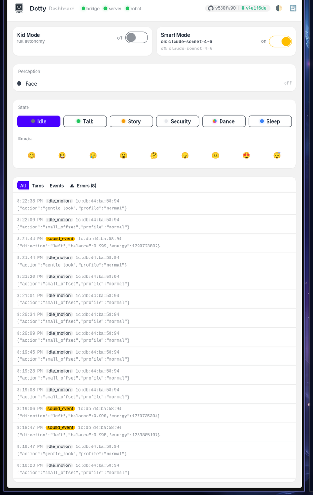
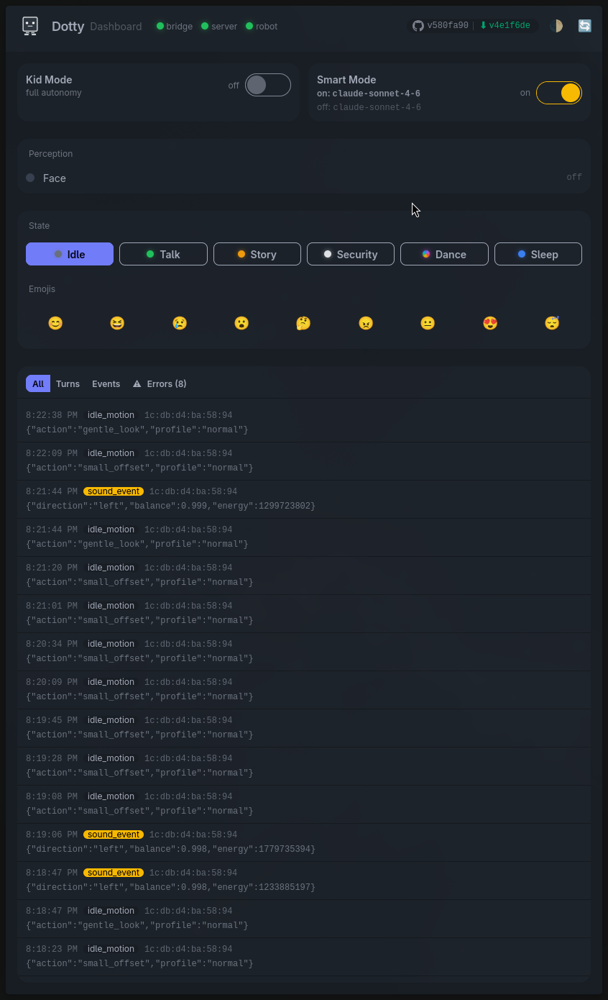

  

# Dotty

**Your self-hosted [StackChan](https://github.com/m5stack/StackChan) robot assistant -- kid-safe by default, hackable by design, private by architecture.**

Dotty is a fully self-hosted voice stack for the M5Stack StackChan desktop robot. Open-source firmware on the device, [xiaozhi-esp32-server](https://github.com/xinnan-tech/xiaozhi-esp32-server) for voice I/O, and a small FastAPI bridge to whatever LLM agent you want as the brain. ASR, TTS, session state, and persona all run on your own hardware. The LLM is pluggable -- the reference config uses OpenRouter, but swap in Ollama for fully offline operation with no code changes.

Out of the box, Dotty ships in **Kid Mode** -- age-appropriate language, safety guardrails, and content filtering are on by default. Disable Kid Mode for a general-purpose assistant. The default persona is named "Dotty" (rename it during `make setup`).

> **v0.1 - early-feedback release.** Dotty works end-to-end on the maintainer's hardware. This first tagged release is to invite real-world feedback before v1.0 polish. **Known issues:** face emoji rendering is missing visual differentiation for 4 of 9 emotions (sad / surprise / love / laughing); sound-direction localizer has a hardware-AEC-related left-bias on M5Stack CoreS3 (energy detection works, direction is unreliable); kid-voice ASR accuracy on SenseVoice has a kid-speech gap that whisper.cpp will close in a follow-up. Full backlog in `tasks.md` (private). Bugs, PRs, and "this didn't work for me" issues all very welcome. 🍺☕ I haven't tried deploying this end-to-end on a fresh setup yet, so if you do, please get in touch — I'll buy you a beer or a coffee.

## Why I built this

I didn't like the idea of a camera and microphone running in my house unless I could (1) self-host the whole stack end-to-end and (2) understand the whole stack end-to-end. Off-the-shelf voice assistants fail both tests - audio leaves the house, the model is opaque, and you're trusting a vendor's privacy posture forever.

So Dotty is the version that passes: every component runs on hardware I own, every seam is documented and swappable, and the only thing that can leave the LAN is whatever LLM call I explicitly route out (and even that swaps to a local model with a config change). It's also meant to be fun - a friendly desktop robot for the kids, and an interesting hobby project to keep building on.

## Features

- **Kid Mode (on by default)** -- age-appropriate responses, content filtering, and safety guardrails. Toggle off for general-purpose use. See [`docs/kid-mode.md`](./docs/kid-mode.md).
- **Local ASR** -- FunASR SenseVoiceSmall runs on your hardware, no cloud transcription.
- **Local or cloud TTS** -- Piper (offline) or EdgeTTS (cloud). Swap with a config change.
- **Streaming responses** -- the bridge streams LLM output to the voice pipeline for lower perceived latency.
- **Emoji expressions** -- every response starts with an emoji that the firmware maps to a face animation (smile, laugh, sad, surprise, thinking, angry, love, sleepy, neutral).
- **MCP tools** -- ZeroClaw exposes tools (web search, memory, etc.) to the LLM via the Model Context Protocol.
- **States, toggles & LEDs** -- a six-state mutex (`idle / talk / story_time / security / sleep / dance`) plus orthogonal toggles (`kid_mode`, `smart_mode`) drive both behaviour and the 12-pixel LED ring. See "States, Toggles & LEDs" below.
- **Vision (camera)** -- the StackChan's built-in camera can capture images for multimodal LLM queries.
- **Persona system** -- swappable persona prompts in `personas/`. Change the robot's personality without touching code.
- **Calendar context** -- optional calendar integration feeds upcoming events into the conversation context.
- **Hackable** -- every seam is swappable: LLM, TTS, ASR, agent framework, persona. Fork it, rip out what you don't want, wire in your own.

## States, Toggles & LEDs

Behaviour is a **six-state mutex** (`idle / talk / story_time / security / sleep / dance`) plus two orthogonal toggles (`kid_mode`, `smart_mode`), all owned by the firmware StateManager. Voice phrases, camera edges, and dashboard controls all flow through it.

The 12-pixel LED ring shows the current state at a glance: **left ring 0-5 is the state arc** (all six pixels paint the state colour — green for `talk`, warm for `story_time`, dim blue for `sleep`, white-flashing for `security`, rainbow for `dance`, off for `idle`). On the right ring, **indices 8-9 are toggle pips** for kid_mode (warm pink) and smart_mode (orange), and **index 11 (bottom) lights red while you have the turn** (LISTENING). The `idle → talk` transition fires on `face_detected` from the firmware; VLM identity recognition runs in parallel and feeds the persona.

Full state taxonomy, colour palette, transition diagram, and per-state backing architecture: [`docs/modes.md`](./docs/modes.md).

## Web dashboard (locally hosted)

The bridge serves a web dashboard at `http://<ZEROCLAW_HOST>:8080/ui` — host status, mode toggles (Kid Mode / Smart Mode), state switcher, perception card (face / identity), emoji presets, and a live event log (turns, perception events, errors). Light and dark themes follow the system preference. It's served from the same FastAPI process as the bridge, so there's nothing extra to deploy and no external service ever sees your data.

  
  &nbsp;
  

## Reference deployment

- **Hardware**: M5Stack StackChan (CoreS3 + servo kit), firmware built from `m5stack/StackChan`.
- **Brain**: [ZeroClaw](https://github.com/zeroclaw-labs/zeroclaw) on any host that can run it (a small Linux box, your existing home server, or even the same Docker host), with Mistral Small 3.2 via OpenRouter as the default LLM (Qwen3-30B, Claude, and others are drop-in alternates).
- **Voice I/O**: xiaozhi-esp32-server on Docker (any Linux Docker host; single-host works too).

## What runs where

| Component | Host | Notes |
|---|---|---|
| StackChan (device) | ESP32-S3 on the desk | Firmware built from `m5stack/StackChan` (see `SETUP.md`) |
| xiaozhi-esp32-server | Docker host (`<XIAOZHI_HOST>`) | Docker, ports 8000 + 8003 |
| zeroclaw-bridge | ZeroClaw host (`<ZEROCLAW_HOST>`) | FastAPI on port 8080, systemd |
| ZeroClaw daemon | ZeroClaw host (`<ZEROCLAW_HOST>`) | `<ZEROCLAW_BIN>` |
| Admin workstation | any LAN box | Development / `ssh` only |

## Get it running

- [`docs/quickstart.md`](./docs/quickstart.md) -- 15-minute happy path: flash, configure, first turn. Includes placeholder substitution table, deployment layout, endpoints, reboot survival, and common ops snippets.
- [`docs/troubleshooting.md`](./docs/troubleshooting.md) -- symptom-first lookup for common (and obscure) failure modes.

## Deeper reference

For what the stack *is* underneath -- hardware specs, protocol docs, model facts, and features we aren't using -- see [`docs/`](./docs/README.md):

- [docs/architecture.md](./docs/architecture.md) -- end-to-end data flow, topology, deployment files, threat model.
- [docs/hardware.md](./docs/hardware.md) -- M5Stack StackChan body + firmware lineage + on-device MCP tool catalog.
- [docs/voice-pipeline.md](./docs/voice-pipeline.md) -- xiaozhi-esp32-server internals, FunASR/SenseVoice, VAD, TTS.
- [docs/brain.md](./docs/brain.md) -- ZeroClaw architecture, LLM model details, OpenRouter role.
- [docs/protocols.md](./docs/protocols.md) -- Xiaozhi WS framing, MCP-over-WS, ACP JSON-RPC, emotion channel.
- [docs/modes.md](./docs/modes.md) -- behavioural mode taxonomy + LED contract + transition diagram.
- [docs/latent-capabilities.md](./docs/latent-capabilities.md) -- features upstream supports that we aren't using yet.
- [docs/references.md](./docs/references.md) -- canonical upstream URLs, model cards, licenses.

## References

- xiaozhi-esp32-server: https://github.com/xinnan-tech/xiaozhi-esp32-server
- xiaozhi-esp32 firmware (upstream): https://github.com/78/xiaozhi-esp32
- ZeroClaw: https://github.com/zeroclaw-labs/zeroclaw
- StackChan (hardware + open firmware): https://github.com/m5stack/StackChan
- Emotion protocol: https://xiaozhi.dev/en/docs/development/emotion/
