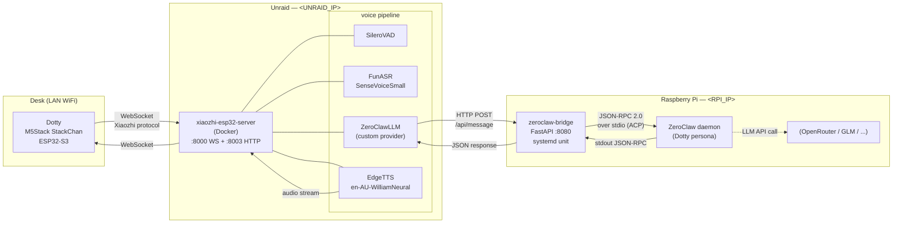
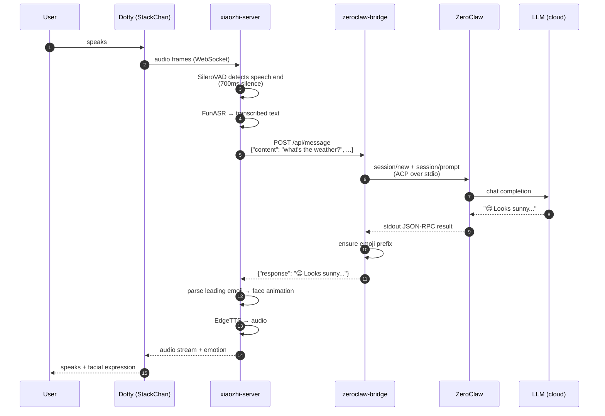

# Dotty — StackChan Infrastructure

Self-hosted voice pipeline for **Dotty**, a desktop robot assistant.
Hardware: M5Stack **StackChan** running firmware built from `m5stack/StackChan`.
Brain: **ZeroClaw** running on a Raspberry Pi.
Voice I/O: **xiaozhi-esp32-server** on Unraid.

Everything except EdgeTTS runs on the local LAN — no cloud AI account required.

---

## TL;DR — what runs where

| Component | Host | Notes |
|---|---|---|
| Dotty (hardware) | ESP32-S3 on the desk | Firmware built from `m5stack/StackChan` (see `SETUP.md`) |
| xiaozhi-esp32-server | Unraid (`<UNRAID_IP>`) | Docker, ports 8000 + 8003 |
| zeroclaw-bridge | RPi (`<RPI_IP>`) | FastAPI on port 8080, systemd |
| ZeroClaw daemon | RPi (`<RPI_IP>`) | `<RPI_ZEROCLAW_BIN>` |
| Admin workstation | any LAN box | Development / `ssh` only |

---

## Configuring for your environment

This repo uses placeholders in place of real IPs, usernames, and filesystem paths. Substitute these everywhere before deploying:

| Placeholder | Meaning |
|---|---|
| `<UNRAID_IP>` | LAN IP of the Unraid (or other Docker) host running xiaozhi-server. StackChan reaches this on WiFi, so it must be a LAN IP — not a Tailscale/VPN IP. |
| `<UNRAID_USER>` | SSH user for the Unraid box (Unraid default: `root`). |
| `<UNRAID_HOST>` | Unraid hostname or Tailscale name (optional — IP works for everything). |
| `<UNRAID_XIAOZHI_PATH>` | Path on Unraid where you clone/install xiaozhi-server. Unraid convention: `/mnt/user/appdata/xiaozhi-server/`. |
| `<RPI_IP>` | LAN IP of the Raspberry Pi running ZeroClaw + the bridge. |
| `<RPI_USER>` | SSH user on the Pi (DietPi default: `dietpi`; root is also common). |
| `<RPI_HOME>` | Home directory on the Pi for the user that owns the bridge (e.g. `/root/` or `/home/pi/`). |
| `<RPI_BRIDGE_PATH>` | Full path to the zeroclaw-bridge working directory on the Pi (e.g. `/root/zeroclaw-bridge/`). |
| `<RPI_ZEROCLAW_BIN>` | Absolute path to the `zeroclaw` binary on the Pi (cargo default: `/root/.cargo/bin/zeroclaw`). |
| `<RPI_ZEROCLAW_CFG>` | ZeroClaw config file path (default: `/root/.zeroclaw/config.toml`). |
| `<YOUR_NAME>` | Your name / org, used in the persona prompt in `.config.yaml`. |

Port numbers (`8000`, `8003`, `8080`, `18789`, `42617`) are product-generic and should not be changed unless you also reconfigure the respective services.

Files you will definitely need to edit before first run:

- `.config.yaml` — replace `<UNRAID_IP>`, `<RPI_IP>`, and customize the `prompt:` block.
- `docker-compose.yml` — set `TZ` to your timezone.
- `zeroclaw-bridge.service` — adjust paths if the bridge doesn't live at `/root/zeroclaw-bridge/`.

---

## High-level architecture



### Why this shape?

- **xiaozhi-server handles audio** (ASR + TTS) because the StackChan firmware already speaks its WebSocket protocol. Minimal firmware work.
- **ZeroClaw is the brain** because it has the tools, memory, channels, and LLM routing already set up. Dotty is just another way to reach the same agent.
- **A small bridge lives in between** because ZeroClaw's gateway HTTP API only *reads* session state. The bridge talks to ZeroClaw via the Agent Client Protocol (JSON-RPC 2.0 over stdio) against a long-running `zeroclaw acp` child.

---

## Message flow (single user utterance)



Typical end-to-end latency: **~4–5s** per turn, dominated by the LLM call (ASR/TTS are both fast).

---

## Deployment layout

```mermaid
flowchart TB
    subgraph Unraid_fs["Unraid filesystem — &lt;UNRAID_XIAOZHI_PATH&gt;"]
        direction TB
        UA1["data/.config.yaml<br/>(override — voice, persona, endpoints)"]
        UA2["models/SenseVoiceSmall/<br/>(model.pt + configs)"]
        UA3["custom-providers/zeroclaw/<br/>(zeroclaw.py + __init__.py)"]
        UA3b["custom-providers/edge_stream/<br/>(edge_stream.py + __init__.py)"]
        UA3c["custom-providers/asr/fun_local.py<br/>(patched ASR — language key)"]
        UA4["tmp/<br/>(TTS audio scratch)"]
        UA5["repo/<br/>(git clone, reference only)"]
        UA6["docker-compose.yml"]
    end

    subgraph RPi_fs["RPi filesystem"]
        direction TB
        RA["&lt;RPI_BRIDGE_PATH&gt;"]
        RA1["bridge.py"]
        RA2[".venv/<br/>(fastapi + uvicorn)"]
        RB["/etc/systemd/system/<br/>zeroclaw-bridge.service"]
        RC["~/.zeroclaw/<br/>(Dotty agent config)"]
        RA --> RA1 & RA2
    end
```



Container volume mounts:

| Host path | Container path | Purpose |
|---|---|---|
| `data/.config.yaml` | `/opt/xiaozhi-esp32-server/data/.config.yaml` | Config override (read-only mount) |
| `models/SenseVoiceSmall/` | `/opt/xiaozhi-esp32-server/models/SenseVoiceSmall/` | ASR weights |
| `tmp/` | `/opt/xiaozhi-esp32-server/tmp/` | Scratch |
| `custom-providers/zeroclaw/` | `/opt/xiaozhi-esp32-server/core/providers/llm/zeroclaw/` | Custom LLM provider |
| `custom-providers/edge_stream/` | `/opt/xiaozhi-esp32-server/core/providers/tts/edge_stream/` | Custom streaming TTS provider |
| `custom-providers/asr/fun_local.py` | `/opt/xiaozhi-esp32-server/core/providers/asr/fun_local.py` | Patched FunASR — adds `language` config key so SenseVoiceSmall can be pinned to English |

---

## Endpoints

| What | URL | Who calls it |
|---|---|---|
| OTA (enter into StackChan settings) | `http://<UNRAID_IP>:8003/xiaozhi/ota/` | StackChan device on boot |
| WebSocket | `ws://<UNRAID_IP>:8000/xiaozhi/v1/` | StackChan device after OTA handshake |
| Bridge (chat) | `http://<RPI_IP>:8080/api/message` | xiaozhi-server's ZeroClawLLM |
| Bridge (health) | `http://<RPI_IP>:8080/health` | Humans, monitoring |
| ZeroClaw gateway | `http://127.0.0.1:42617` (RPi-local) | ZeroClaw's web UI only |

---

## Reboot survival

Both services restart themselves without manual intervention:

| Host | Mechanism |
|---|---|
| Unraid | Array auto-start (`startArray=yes`) + Docker service auto-start (`DOCKER_ENABLED=yes`) + container `restart: unless-stopped`. dockerd starts containers that were running and weren't explicitly `docker stop`ped. |
| RPi | `zeroclaw-bridge.service` is `enabled`, `Restart=on-failure`. |

Caveat: if you run `docker compose down` on Unraid, the container is marked
stopped and won't come back on reboot. Use `docker compose restart` or
`docker restart xiaozhi-esp32-server` for transient restarts instead.

---

## Common ops

```bash
# Tail xiaozhi-server logs (voice pipeline)
ssh <UNRAID_USER>@<UNRAID_IP> 'docker logs -f xiaozhi-esp32-server'

# Tail bridge logs
ssh <RPI_USER>@<RPI_IP> 'sudo journalctl -u zeroclaw-bridge -f'

# Restart voice pipeline after config change
ssh <UNRAID_USER>@<UNRAID_IP> 'cd <UNRAID_XIAOZHI_PATH> && docker compose restart'

# Restart the bridge
ssh <RPI_USER>@<RPI_IP> 'sudo systemctl restart zeroclaw-bridge'

# Smoke test full round-trip
curl -X POST http://<RPI_IP>:8080/api/message \
  -H 'content-type: application/json' \
  -d '{"content":"hello","channel":"stackchan"}'

# Bridge health
curl http://<RPI_IP>:8080/health
```

### Changing voice
Edit `data/.config.yaml` → `TTS.EdgeTTS.voice` (or `TTS.StreamingEdgeTTS.voice`) on Unraid. Any Microsoft Edge Neural voice ID works (e.g. `en-US-AvaNeural`, `ja-JP-NanamiNeural`). Restart the container.

### Changing persona (Dotty's personality)
Primary source: ZeroClaw's own system prompt in `<RPI_ZEROCLAW_CFG>` on the RPi. The `prompt:` key in `data/.config.yaml` is a secondary hint that the bridge passes to ZeroClaw as context, but ZeroClaw's own prompt wins.

### Changing VAD sensitivity
`VAD.SileroVAD.min_silence_duration_ms` in `data/.config.yaml`. Default: 700ms. Lower = cuts off quicker. Higher = waits longer for slow speakers.

### Changing the LLM model
`default_model` key near the top of `<RPI_ZEROCLAW_CFG>` on the RPi (provider and encrypted api_key live next to it). ACP mode caches config in the long-running child, so restart the bridge (`sudo systemctl restart zeroclaw-bridge`) after editing. Confirm with `sudo <RPI_ZEROCLAW_BIN> status | grep Model`.

---

## File inventory (this repo)

| File | Deployed to | Purpose |
|---|---|---|
| `bridge.py` | RPi `<RPI_BRIDGE_PATH>/bridge.py` | FastAPI HTTP→ZeroClaw translator (ACP over stdio) |
| `zeroclaw-bridge.service` | RPi `/etc/systemd/system/` | systemd unit for bridge |
| `zeroclaw.py` | Unraid `custom-providers/zeroclaw/zeroclaw.py` | xiaozhi LLM provider |
| `zeroclaw__init__.py` | Unraid (as `__init__.py`) | Python package marker |
| `edge_stream.py` | Unraid `custom-providers/edge_stream/edge_stream.py` | Streaming EdgeTTS provider |
| `edge_stream__init__.py` | Unraid (as `__init__.py`) | Python package marker |
| `fun_local.py` | Unraid `custom-providers/asr/fun_local.py` | Patched FunASR provider (adds `language` config key) |
| `.config.yaml` | Unraid `data/.config.yaml` | xiaozhi-server config override |
| `docker-compose.yml` | Unraid `<UNRAID_XIAOZHI_PATH>` | Container definition |

These are the canonical working copies. The deployed files on the servers
should match — if they drift, redeploy from here.

---

## Troubleshooting

**"Bridge unreachable" or "(no response)" in Dotty's voice.**
The xiaozhi-server couldn't reach the bridge. Check `systemctl status zeroclaw-bridge` on the RPi and `curl http://<RPI_IP>:8080/health` from anywhere on the LAN.

**xiaozhi-server won't start, log says `ModuleNotFoundError`.**
Check the container logs for the actual missing module. The image ships with most deps but the streaming TTS provider uses `pydub` and `edge-tts` — if they're missing, add them via the compose file or bake a custom image.

**StackChan/Dotty connects but never responds.**
Open a test page in your browser: copy `repo/main/xiaozhi-server/test/test_page.html` locally and point its WS URL at `ws://<UNRAID_IP>:8000/xiaozhi/v1/`. If the browser page works but the device doesn't, the device has the wrong OTA URL — re-enter it in the device's Advanced Options.

**No facial expression change on the robot.**
The response didn't start with a supported emoji. Check bridge logs to see what came back from ZeroClaw; the bridge appends 😐 as a fallback but that means no meaningful animation.

**Docker image upgrade breaks things.**
Pin the image tag in `docker-compose.yml` before upgrading. The `server_latest` tag is a moving target.

---

## References

- xiaozhi-esp32-server: https://github.com/xinnan-tech/xiaozhi-esp32-server
- xiaozhi-esp32 firmware (upstream): https://github.com/78/xiaozhi-esp32
- ZeroClaw: https://github.com/zeroclaw-labs/zeroclaw
- StackChan (hardware + open firmware): https://github.com/m5stack/StackChan
- Emotion protocol: https://xiaozhi.dev/en/docs/development/emotion/
