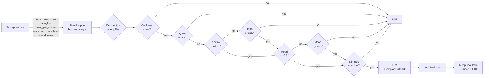

# Engagement Decider (Phase 4)

The engagement-decision sublayer is the arbiter for **all** unprompted
behaviours. Where Layer 6's [Proactive Greeter](proactive-greetings.md)
is a single-purpose face → greeting reactor, the engagement decider is
the general "should we say something now?" gate that sits between the
perception bus and any future server-initiated speech path.

This is the headline payoff of Phase 4: **Dotty notices you walk in
and chimes up on its own** — but with cooldowns, quiet hours, and a
mood scalar so the robot stays charming rather than chatty.

!!! warning "Default OFF"
    `ENGAGEMENT_ENABLED=false` by default. This is a big behaviour
    change — the robot starts speaking without being addressed.
    Operators must opt in explicitly.

## Architecture



The decider pulls perception events into a small recent-history
buffer (the **stimulus pool**) and runs a periodic tick that walks an
ordered cascade of intent types. The first intent that clears every
gate fires; everything else waits for the next tick.

## Mood scalar

A single `[0.0, 1.0]` float that decays exponentially toward `0.5`
(neutral) with τ = 10 minutes by default. Perception events nudge it
in either direction; sustained silence pulls it down slowly so a
quiet room doesn't get a "good morning" out of nowhere when nobody's
been around for hours.

| Event                          | Δ mood    |
| ------------------------------ | --------- |
| TTS push succeeded (any intent)| **+0.10** |
| `face_recognized` (known)      | +0.05     |
| `voice_turn_completed`         | +0.05     |
| `head_pet_started`             | +0.10     |
| `face_lost`                    | -0.05     |
| Per minute of total silence    | -0.02     |
| Decay toward 0.5               | τ=10 min  |

When mood drops below `0.3`, only **mood-bypass intents**
(`calendar_reminder`) are allowed to fire. Everything else waits for
mood to recover.

!!! note "Tuning warning"
    These coefficients are starter values informed by intuition.
    They will need real-world tuning once the loop is wired up; the
    current numbers are visible as constants on the
    `EngagementDecider` class for easy adjustment.

## Intent types

| Intent              | Default cooldown | Stimulus required               | Kid-mode? | Time-of-day respect |
| ------------------- | ---------------- | -------------------------------- | --------- | ------------------- |
| `calendar_reminder` | 2 h              | calendar facade returns events  | yes       | bypasses out-of-window |
| `casual_greeting`   | 30 min           | recent `face_recognized` (known) | yes       | bypasses out-of-window |
| `time_marker`       | 4 h              | any recent activity              | yes       | active-window only   |
| `unknown_face`      | 1 h              | recent `face_detected` / unknown id (gated by `GREETER_GREET_UNKNOWN`) | yes | active-window only |
| `curiosity`         | 6 h              | any history + mood ≥ 0.5         | yes       | active-window only   |

Quiet hours hard-block **all** of the above — even
`calendar_reminder`. If the user is asleep, the robot stays quiet.

## Configuration matrix

| Variable                                    | Default                            | Notes                                                  |
| ------------------------------------------- | ---------------------------------- | ------------------------------------------------------ |
| `ENGAGEMENT_ENABLED`                        | `false`                            | Master switch — opt in.                                |
| `ENGAGEMENT_TICK_SEC`                       | `30`                               | Tick period in seconds.                                |
| `ENGAGEMENT_QUIET_HOURS`                    | `22:00-06:00`                      | `HH:MM-HH:MM`. Wraps midnight.                         |
| `ENGAGEMENT_ACTIVE_WINDOW`                  | `06:00-21:00`                      | Outside this, only HP intents pass.                    |
| `ENGAGEMENT_MOOD_DECAY_MIN`                 | `10`                               | τ for decay toward neutral.                            |
| `ENGAGEMENT_UTTERANCE_MAX_WORDS`            | `18`                               | Hard cap embedded in the LLM prompt.                   |
| `ENGAGEMENT_STATE_PATH`                     | `~/.zeroclaw/engagement_state.json`| Atomic-write JSON.                                     |
| `ENGAGEMENT_COOLDOWN_CASUAL_GREETING`       | `1800`                             | Seconds. Per-intent override.                          |
| `ENGAGEMENT_COOLDOWN_CALENDAR_REMINDER`     | `7200`                             |                                                        |
| `ENGAGEMENT_COOLDOWN_TIME_MARKER`           | `14400`                            |                                                        |
| `ENGAGEMENT_COOLDOWN_CURIOSITY`             | `21600`                            |                                                        |
| `ENGAGEMENT_COOLDOWN_UNKNOWN_FACE`          | `3600`                             |                                                        |
| `GREETER_GREET_UNKNOWN`                     | `false`                            | Reused — gates the `unknown_face` intent.              |

## Persistence

The cooldown registry and mood scalar are persisted on every tick to
`ENGAGEMENT_STATE_PATH`. Writes are atomic (`temp + os.replace`) so a
mid-write crash leaves the previous state intact. Corrupt or
non-dict state files are treated as "fresh start" rather than fatal —
the same defensive contract Layer 6 uses for its greet log.

## Privacy

- The state file is **local**. It contains a single float (mood) and
  a small dict of `intent_type → unix_ts` cooldown timestamps.
- **No biometric data is stored.** The decider reads identity from
  perception events but never persists names, faces, or audio.
- The decider does **not** enable face recognition. It only consumes
  events that Layer 4 (a still-scaffold layer) would otherwise emit.
- All external calls (LLM, TTS, calendar, filesystem, perception bus)
  are try/except guarded; a decider failure cannot break the
  perception bus or the voice path.

## Operator notes

### Debugging

Set the bridge log level to `DEBUG` and watch journalctl for
`engagement_tick` lines:

```bash
journalctl -u zeroclaw-bridge -f | grep engagement
```

Each tick logs mood, active-window state, pool size, and the
suppression reason for any intent that didn't pass. A successful fire
logs at `INFO`:

```
engagement_tick: fired intent=casual_greeting device=dev-1 text='Good morning, Hudson!'
```

### Resetting state

Stop the bridge, delete `~/.zeroclaw/engagement_state.json`, restart.
Mood will reset to `0.5` and all cooldowns will clear.

### Disabling at runtime

Set `ENGAGEMENT_ENABLED=false` in the bridge environment and restart
`zeroclaw-bridge.service`. The decider treats the env as
construction-time configuration; toggling without a restart is
deliberately not supported.

## Cross-references

- **[Proactive Greeter (Layer 6)](proactive-greetings.md)** — the
  existing single-purpose greeter. A future change can route its
  greetings through the engagement decider for unified cooldown
  discipline; until that ships, the two run independently with
  separate cooldowns. (Operators who enable both will see the
  greeter fire on `face_recognized` AND the decider's
  `casual_greeting` intent fire on its tick — pick one or stagger
  cooldowns until the merge happens.)
- **Layer 4 — face recognition**: scaffold; emits the
  `face_recognized` events the decider keys on for
  `casual_greeting`.
- **Layer 5 — calendar facade**: source of `calendar_reminder`
  evidence via `get_events()` + `summarize_for_prompt(...)`.
- **[Modes](modes.md)** — interaction-mode taxonomy. The decider is
  active in normal smart-mode; a future iteration may suppress it in
  story-mode and similar focused modes.

## Status

**Scaffolded; bridge wiring deferred.** This module ships as a new
file with full unit-test coverage. The `bridge.py` lifespan hook that
will instantiate it lives behind the public-repo concurrency boundary
and is being added in a follow-up commit. Until that lands, the
decider is dormant — it will not start, even with
`ENGAGEMENT_ENABLED=true`.
