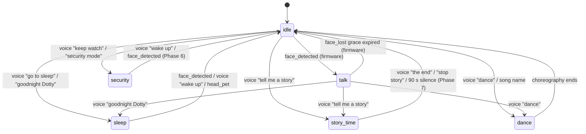

# States, Toggles & LED Contract

> **Honesty note.** This page describes a target architecture. The bridge-side perception bus and the kid/smart toggles are shipped and working today; the firmware **StateManager** that owns the six-state mutex, paints the LED contract, and emits `state_changed` events **does not yet exist** in the `BrettKinny/StackChan @ dotty` submodule (`grep -rn "StateManager" firmware/` returns zero structural matches as of 2026-05-17). The `/xiaozhi/admin/set-state` endpoint dispatches the MCP call onto the WS, but no firmware handler currently consumes it. Sections marked **🚧 Phase 4 (not yet shipped)** are the design spec for the upcoming firmware work; everything else is live.

This document is the source of truth for the *model* of Dotty's high-level modes. The model has two axes:

- **STATE** — what Dotty is *doing right now*. Mutually exclusive — exactly one State is active. Six values: `idle`, `talk`, `story_time`, `security`, `sleep`, `dance`. 🚧 Phase 4 (not yet shipped). The bridge tracks `_perception_state[device_id]["current_state"]` and *would* update it from firmware `state_changed` events; until the firmware emits them, the value defaults to `idle` for every device.
- **TOGGLES** — orthogonal modifiers that can be on regardless of state. Two values today: `kid_mode`, `smart_mode`. Toggles compose freely with state. **Shipped** — kid_mode hot-reloads via `_apply_kid_mode()`; smart_mode hot-swaps the Tier1Slim provider in-process via `/xiaozhi/admin/set-tier1slim-model` (commit `b83898e`).

Pair this with [hardware.md](./hardware.md) (the physical LED ring + servos) and [interaction-map.md](./interaction-map.md) (the underlying signals).

---

## What ships today (2026-05-17)

| Concern | Where | Status |
|---|---|---|
| `kid_mode` toggle (state file + bridge-side hot-reload) | bridge `_apply_kid_mode()` | ✅ shipped |
| `smart_mode` toggle (state file + persistence) | bridge `_read_smart_mode` / `_write_smart_mode` | ✅ shipped |
| Smart-mode flip when `DOTTY_VOICE_PROVIDER=tier1slim` | bridge → `/xiaozhi/admin/set-tier1slim-model` | ✅ shipped — in-process hot-swap, no daemon restart |
| Smart-mode flip when `DOTTY_VOICE_PROVIDER=zeroclaw` | bridge rewrites `~/.zeroclaw/config.toml`, restarts daemon | ✅ shipped (legacy path) |
| Perception event bus (face_detected / face_lost / sound_event) | firmware → xiaozhi `EventTextMessageHandler` → bridge `/api/perception/event` | ✅ shipped |
| Bridge-side perception consumers (face_greeter, sound_turner, face_lost_aborter, wake_word_turner, face_identified_refresher, purr_player) | bridge `_perception_*` | ✅ shipped |
| Six-state mutex (idle/talk/story_time/security/sleep/dance) — firmware-side | `firmware/main/stackchan/modes/state_manager.{h,cpp}` | 🚧 not yet built |
| LED contract (12-pixel ring, state arc + toggle pips + listening pip) | firmware StateManager | 🚧 not yet built |
| Voice phrase triggers ("go to sleep", "keep watch", etc.) | bridge (`receiveAudioHandle.py`) + firmware MCP | partial — voice routing exists, but state transitions land on a no-op until firmware consumes `set_state` |
| `state_changed` perception events | firmware → bridge | 🚧 firmware producer not yet built |
| `/xiaozhi/admin/set-state` MCP dispatch | xiaozhi `http_server.py` | ✅ dispatches; firmware MCP handler not yet built — currently a no-op end-to-end |

---

## TL;DR

The firmware boots into the equivalent of `idle` (no formal state machine yet). The bridge resyncs `kid_mode` / `smart_mode` from disk on each reconnect. Plain conversational turns route through whichever LLM provider is selected (`Tier1Slim` by default; `ZeroClawLLM` if you've switched). Phase 4 will introduce the formal state model and the LED contract that goes with it.

**Speech sub-states** will be conveyed by face animations (eye gestures, talking mouth) and the dedicated **listening pixel** when Phase 4 lands. Today the face animations are driven directly by xiaozhi-server's emotion frames and the `LISTENING` indicator is whatever the firmware already paints.

---

## States (mutually exclusive) — 🚧 Phase 4 design spec

| State | LED arc (left ring 0-5) | Idle profile | Behaviour | Backing path |
|---|---|---|---|---|
| `idle` | off `(0,0,0)` | NORMAL | Ambient awareness, gentle idle motion. Default. | n/a (no chat in flight) |
| `talk` | dim green `(0,60,0)` | NORMAL (face_tracking overlay active) | Conversation engaged. Listening pixel (right 11) lights red while the user has the turn; `thinking` and `speaking` are face-animation only. | Tier1Slim → llama-swap, or ZeroClawLLM → ACP |
| `story_time` | warm `(100,40,0)` | NORMAL | Long-running interactive story. Bridge bypasses ZeroClaw, calls OpenRouter directly with story persona + rolling context. | bridge → direct OpenRouter (Phase 7) |
| `security` | white `(80,80,80)` **flashing 1 Hz** across all 6 left pixels | SURVEILLANCE | Wide deliberate scan, serious face, periodic photo + audio capture. No proactive greet. | bridge ambient task (Phase 6) |
| `sleep` | very dim blue `(0,0,16)` | SLEEPY | Head face-down + centred, servo torque off, sleeping emoji on screen, ambient awareness paused. Wakes on face / voice / head-pet. | firmware-only quiescence (Phase 5) |
| `dance` | rainbow sweep (left ring) | NORMAL | Transient performance — choreography + audio. Pre-existing dance handler. | `receiveAudioHandle.py::_handle_dance` |

The `idle → talk` trigger is the firmware `face_detected` event (any face, family or stranger). The bridge runs VLM recognition (`bridge.py::_capture_room_view`) in parallel and feeds the resulting identity into the speaker resolver / persona — recognition does **not** gate the state transition.

### Mutex rules (design)

1. Exactly **one** state is current. `setState(S)` to the same state is a no-op.
2. State transitions are explicit — no implicit "fallback" to idle from other states; each non-idle state has its own exit triggers.
3. Camera edges only auto-transition between `idle` ↔ `talk`. Sticky states (`story_time`, `security`, `sleep`, `dance`) ignore face_detected / face_lost.

---

## Toggles (compose freely) — ✅ shipped

| Toggle | Toggle pip (right ring) | What it does | Persistence |
|---|---|---|---|
| `kid_mode` | 🚧 salmon pink `(220,80,80)` at index **8** (pip not yet rendered) | Guardrails — content sandwich, camera tools denied, kid-safe persona. Does not pick the model. Hot-reloads via `_apply_kid_mode()` (no daemon restart). | `/root/zeroclaw-bridge/state/kid-mode` |
| `smart_mode` | 🚧 orange `(168,80,0)` at index **9** (pip not yet rendered) | Voice-daemon model selector. ON → `SMART_MODEL` (claude-sonnet-4-6 by default); OFF → local default. Flip is in-process when `DOTTY_VOICE_PROVIDER=tier1slim`; daemon-restart when `=zeroclaw`. | `/root/zeroclaw-bridge/state/smart-mode` |

The two toggles are orthogonal — they compose freely. `kid_mode = on` AND `smart_mode = on` runs the smart model behind the kid-safe sandwich. Both toggles are sticky across turns, daemon restarts, and reboots.

`smart_mode` is **dashboard- and admin-endpoint-only** — there is no voice trigger. Kids reach Dotty by voice but not the web dashboard, so dashboard-only is the access-control gate that keeps the more capable (and more expensive) model under household-head control.

---

## LED contract (12-pixel ring) — 🚧 Phase 4 design spec

```
LEFT RING (global 0–5)              RIGHT RING (global 6–11)
┌───────────────────┐               ┌────────────────────────────┐
│ 0  state arc      │               │ 6  face state (TOP)        │
│ 1  state arc      │               │ 7  reserved (locked off)   │
│ 2  state arc      │               │ 8  kid_mode toggle         │
│ 3  state arc      │               │ 9  smart_mode toggle       │
│ 4  state arc      │               │ 10 reserved (locked off)   │
│ 5  state arc      │               │ 11 listening (BOTTOM)      │
└───────────────────┘               └────────────────────────────┘
```

| Index | Half | Owner (planned) | Behaviour (planned) |
|---|---|---|---|
| 0–5 | left | StateManager (state arc) | All six paint the current mutex-state colour. Dance suppresses and lets the rainbow animation own the ring. |
| 6 | right | StateManager (face state pip) | Two-state pip: lit when a face is detected; alternate hue when the bridge has identified the face via room-view VLM + roster match. The bridge calls `/xiaozhi/admin/set-face-identified` to refresh on each match (4 s firmware-side timeout). |
| 7, 10 | right | StateManager (locked off) | Reserved for future indicators (low-battery is a known candidate). Re-asserted to `(0,0,0)` every 200 ms as defense-in-depth. |
| 8 | right | StateManager (`kid_mode` pip) | Lit when kid_mode = on; off otherwise. Use a warm hue with G == B so PY32 RGB565 quantization doesn't push it cool. |
| 9 | right | StateManager (`smart_mode` pip) | Lit when smart_mode = on; off otherwise. |
| 11 | right | StateManager (listening pip) | Lit while xiaozhi is in `LISTENING` (mic open, ASR active, user's turn); off otherwise. Driven by `stackchan_display.cc::set_listening_pixel` (this currently exists in the m5stack StackChan upstream; the StateManager wrapper is Phase 4). Bottom of the right ring; spatially separated from the toggle pips. |

> **Specific RGB values intentionally omitted from this table.** The original draft of this doc named exact triples (e.g. `(168,140,0)` / `(0,140,30)` / `(220,80,80)` / `(168,80,0)`), but those have no source-of-truth in the firmware tree yet — they were design suggestions. The implementing engineer should pick values that survive PY32 RGB565 quantization (favour distinct hues over brightness deltas) and add them here when the StateManager lands.

### LED quirks (design)

- **5 Hz tick.** StateManager should re-paint the state arc AND the entire right ring (face / kid / smart / listening / reserved 7 / reserved 10) every ~200 ms. The tick drives the SECURITY 1 Hz flash and the face-identified 4 s timeout, and acts as defense-in-depth re-assert across all status indicators.
- **PY32 IO expander quantises to RGB565.** Brightness deltas crush — `(40,40,40)` reads almost identical to `(200,200,200)`. Use distinct **hues**, not brightness levels, for any indicator that needs to read across a room.
- **MCP tools must be contract-aware.** `self.robot.set_led_color` and `self.robot.set_led_multi` should be restricted to the LEFT ring only (indices 0-5). Attempts to write right-ring indices via these tools should be rejected with a warn log.
- **Dance choreography should only animate the left ring.** Custom JSON dances that set `rightRgbColor` will see that field preserved on the `Keyframe` struct but should not be applied to hardware.
- **Dashboard mirror.** The bridge dashboard at `/ui/led-ring-mirror` shows the four indicators in mirror form, updated via 2 s HTMX polling + `dotty-refresh` event nudges fired by SSE perception events. This is shipped today (the mirror works without the physical ring) and gives the operator a useful preview of what the firmware-side ring will look like.

---

## State transitions (design)



### Voice triggers (Phase 4 design)

| Phrase (substring, case-insensitive) | Target state |
|---|---|
| `goodnight dotty` / `good night dotty` / `go to sleep` | `sleep` |
| `keep watch` / `security mode` / `watch the room` | `security` |
| `tell me a story` / `story time` | `story_time` |
| `wake up` / `come back` / `are you there` (only when state ∈ `{sleep, security, story_time}`) | `idle` |

Both `kid_mode` and `smart_mode` are voice-untoggleable — they are guardian-controlled axes driven from `/admin/kid-mode` and `/admin/smart-mode` (bridge) and reflected via the xiaozhi `/xiaozhi/admin/set-toggle` MCP relay (firmware-side, Phase 4).

### Admin endpoints (today)

| Endpoint | Body | Effect | Where |
|---|---|---|---|
| `POST /admin/kid-mode` | `{"enabled": bool}` | Persists + hot-reloads kid-mode globals atomically. No daemon restart. | bridge (localhost-only) |
| `POST /admin/smart-mode` | `{"enabled": bool, "device_id": "<optional>"}` | Persists + flips voice provider's model. When `DOTTY_VOICE_PROVIDER=tier1slim`: in-process hot-swap via `/xiaozhi/admin/set-tier1slim-model`. When `=zeroclaw`: rewrites `config.toml` + restarts daemon. | bridge (localhost-only) |
| `POST /xiaozhi/admin/set-state` | `{"state": "<...>", "device_id": "<optional>"}` | Dispatches an MCP `self.robot.set_state` call onto the device WS. Firmware MCP handler not yet built — currently a no-op end-to-end. | xiaozhi-server |
| `POST /xiaozhi/admin/set-toggle` | `{"name": "kid_mode\|smart_mode", "enabled": bool, "device_id": "<optional>"}` | Same shape — dispatches `self.robot.set_toggle`. Firmware handler not yet built. | xiaozhi-server |

### MCP tools (firmware) — 🚧 Phase 4

| Tool | Arguments | Caller | Status |
|---|---|---|---|
| `self.robot.set_state` | `{"state": "<...>"}` | xiaozhi-server `/xiaozhi/admin/set-state` relay | dispatched today; no firmware handler |
| `self.robot.set_toggle` | `{"name": "kid_mode\|smart_mode", "enabled": bool}` | xiaozhi-server `/xiaozhi/admin/set-toggle` relay; receiveAudioHandle.py voice phrases | dispatched today; no firmware handler |

---

## Backing architecture per state (design)

| State | Voice path | Memory? | Tools? |
|---|---|---|---|
| `idle` | n/a | n/a | n/a |
| `talk` | xiaozhi → Tier1Slim → llama-swap (default), or xiaozhi → bridge → ZeroClaw ACP (legacy). Smart-mode swaps the inner-loop model. | yes (FTS via memory_lookup tool / full ZeroClaw memory) | yes (4-tool Tier1 catalogue / full ZeroClaw MCP) |
| `story_time` | xiaozhi → bridge → direct OpenRouter (story persona overlay + rolling context) | per-session list (Phase 7) | no |
| `security` | bridge ambient task (no voice path active) | logs to journal | photo + audio capture |
| `sleep` | mic stays on for "wake up"; no LLM round-trip | n/a | n/a |
| `dance` | bridge handler dispatches choreography + audio file | n/a | dance MCP |

`smart_mode` flips the inner-loop model and is sticky across turns. With `DOTTY_VOICE_PROVIDER=tier1slim` (the recommended default) the flip is instantaneous — Tier1Slim's `set_runtime()` mutates the live provider; no docker restart and no daemon restart. `story_time` is the only voice path that bypasses both ZeroClaw and Tier1Slim, with its own session memory.

---

## Implementation status

| Phase | Scope | Status |
|---|---|---|
| 4 | StateManager firmware foundation: state pip + toggle pips + state_changed event + voice phrases + admin endpoints + LED contract | 🚧 designed; not yet built |
| 5 | Sleep state behaviour (servo park + torque off + sleepy emoji + wake triggers) | pending (depends on Phase 4) |
| 6 | Security state behaviour (periodic photo + audio capture, greeter gate) | partial — bridge side has VLM + audio capture; firmware state binding pending |
| 7 | Story_time state (interactive setup, OpenRouter session, choose-your-own-adventure) | pending |
| 8 | Ambient awareness loop (idle-state photo + audio scene capture, journal) | partial — bridge runs `_perception_*` consumers; firmware state binding pending |

Phase 4 establishes the firmware-side *rails* — pip, transition events, dispatch helpers, voice routing. Phases 5–8 each hang behaviour off those rails without changing the architecture. The bridge-side infrastructure (perception bus, consumer tasks, VLM, audio captioning, dashboard mirror) is already in place waiting for the firmware producer.

---

## Sources of truth

**Today (shipped):**
- **Bridge:** `bridge.py` (`_apply_kid_mode`, `_read_smart_mode`, `_write_smart_mode`, `_apply_tier1slim_runtime`, `_admin_smart_mode`, `_admin_kid_mode`, `DOTTY_VOICE_PROVIDER` dispatch, `_perception_*` consumers, `_update_perception_state`)
- **xiaozhi-server patches:** `custom-providers/xiaozhi-patches/http_server.py` (`/xiaozhi/admin/set-state`, `/xiaozhi/admin/set-toggle`, `/xiaozhi/admin/set-tier1slim-model`, `/xiaozhi/admin/set-face-identified`, `/xiaozhi/admin/inject-text`, `/xiaozhi/admin/abort`, `/xiaozhi/admin/set-head-angles`), `custom-providers/xiaozhi-patches/textMessageHandlerRegistry.py` (`EventTextMessageHandler` → bridge perception relay)
- **Dashboard:** `bridge/dashboard.py` + `bridge/templates/state_card.html` + `bridge/templates/smart_mode.html` + `bridge/templates/led_ring_mirror.html`

**Phase 4 (planned):**
- **Firmware:** `firmware/main/stackchan/modes/state_manager.{h,cpp}` (new), `firmware/main/hal/hal_mcp.cpp` MCP handler additions (`self.robot.set_state`, `self.robot.set_toggle`), `firmware/main/stackchan/modifiers/face_tracking.cpp` camera-edge hooks

Last verified: 2026-05-17.
