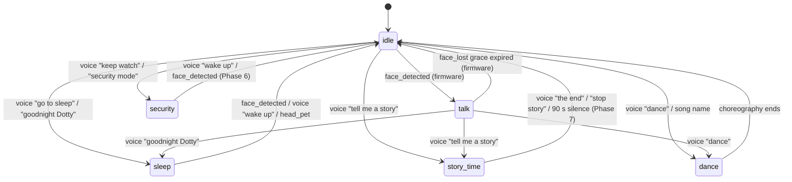

# States, Toggles & LED Contract

This document is the source of truth for Dotty's high-level modes. The model has two axes:

- **STATE** — what Dotty is *doing right now*. Mutually exclusive — exactly one State is active. Six values: `idle`, `talk`, `story_time`, `security`, `sleep`, `dance`.
- **TOGGLES** — orthogonal modifiers that can be on regardless of state. Two values today: `kid_mode`, `smart_mode`. Toggles compose freely with state.

The firmware **StateManager** modifier (`firmware/main/stackchan/modes/state_manager.cpp`) owns both axes. It paints the state arc (left ring 0-5) + toggle pips at 5 Hz, drives the idle-motion profile, and emits `state_changed` perception events on every transition.

Pair this with [hardware.md](./hardware.md) (the physical LED ring + servos) and [interaction-map.md](./interaction-map.md) (the underlying signals).

---

## TL;DR

| Axis | Cardinality | Examples | Owner |
|---|---|---|---|
| State | mutex (1 of 6) | `idle`, `talk`, `story_time` | firmware StateManager |
| Toggle | compose freely | `kid_mode`, `smart_mode` | firmware StateManager |
| Chat sub-state | nested under `talk` / `story_time` | listening (LED) / thinking + speaking (face only) | xiaozhi-server |

The firmware boots into `idle` with both toggles **off**. The bridge resyncs toggles from disk on the first turn after each reconnect. State transitions land via voice phrases, camera edges (face_detected → `talk`), or `/admin/state` from the dashboard.

**Speech sub-states** are conveyed by face animations (eye gestures, talking mouth) and the dedicated **listening pixel** at right-ring index 6. `thinking` and `speaking` have no LED — they live on the face. `listening` lights pixel 6 red so the user knows when their voice is being captured as a turn.

---

## States (mutually exclusive)

| State | LED arc (left ring 0-5) | Idle profile | Behaviour | Backing path |
|---|---|---|---|---|
| `idle` | off `(0,0,0)` | NORMAL | Ambient awareness, gentle idle motion. Default. | n/a (no chat in flight) |
| `talk` | dim green `(0,60,0)` | NORMAL (face_tracking overlay active) | Conversation engaged. Listening pixel (right 6) lights red while the user has the turn; `thinking` and `speaking` are face-animation only. | xiaozhi → bridge → ZeroClaw ACP |
| `story_time` | warm `(100,40,0)` | NORMAL | Long-running interactive story. Bridge bypasses ZeroClaw, calls OpenRouter directly with story persona + rolling context. | bridge → direct OpenRouter (Phase 7) |
| `security` | white `(80,80,80)` **flashing 1 Hz** across all 6 left pixels | SURVEILLANCE | Wide deliberate scan, serious face, periodic photo + audio capture. No proactive greet. | bridge ambient task (Phase 6) |
| `sleep` | very dim blue `(0,0,16)` | SLEEPY | Head face-down + centred, servo torque off, sleeping emoji on screen, ambient awareness paused. Wakes on face / voice / head-pet. | firmware-only quiescence (Phase 5) |
| `dance` | rainbow sweep (left ring) | NORMAL | Transient performance — choreography + audio. Pre-existing dance handler. | `receiveAudioHandle.py::_handle_dance` |

The `idle → talk` trigger is the firmware `face_detected` event (any face, family or stranger). The bridge runs VLM recognition (`bridge.py::_capture_room_view`) in parallel and feeds the resulting identity into the speaker resolver / persona — recognition does **not** gate the state transition.

### Mutex rules

1. Exactly **one** state is current. `setState(S)` to the same state is a no-op.
2. State transitions are explicit — no implicit "fallback" to idle from other states; each non-idle state has its own exit triggers.
3. Camera edges only auto-transition between `idle` ↔ `talk`. Sticky states (`story_time`, `security`, `sleep`, `dance`) ignore face_detected / face_lost.

---

## Toggles (compose freely)

| Toggle | Toggle pip (right ring) | When ON | Persistence |
|---|---|---|---|
| `kid_mode` | warm pink `(168,80,100)` at index **8** | Safety-tuned model, content sandwich, camera tools denied, kid-safe persona | `/root/zeroclaw-bridge/state/kid-mode` |
| `smart_mode` | orange `(168,80,0)` at index **9** | Bridge bypasses ZeroClaw and routes the turn through direct OpenRouter (capable model). No memory, no tools. | `/root/zeroclaw-bridge/state/smart-mode` |

Toggles compose: `kid_mode = on` AND `smart_mode = on` is valid (bridge applies the kid-safe sandwich on top of the direct OpenRouter call). Both toggles are sticky across turns, daemon restarts, and reboots.

---

## LED contract (12-pixel ring)

```
LEFT RING (global 0–5)              RIGHT RING (global 6–11)
┌───────────────────┐               ┌───────────────────────┐
│ 0  state arc      │               │ 6  listening          │
│ 1  state arc      │               │ 7  reserved           │
│ 2  state arc      │               │ 8  kid_mode toggle    │
│ 3  state arc      │               │ 9  smart_mode toggle  │
│ 4  state arc      │               │ 10 reserved           │
│ 5  state arc      │               │ 11 reserved           │
└───────────────────┘               └───────────────────────┘
```

| Index | Half | Owner | Behaviour |
|---|---|---|---|
| 0–5 | left | StateManager (state arc) | All six paint the current mutex-state colour. Dance suppresses and lets the rainbow animation own the ring. |
| 6 | right | xiaozhi `stackchan_display.cc::set_listening_pixel` | Red `(120,0,0)` while xiaozhi is in `LISTENING` (mic open, ASR active, user's turn); off otherwise. |
| 7, 10, 11 | right | unowned (off) | Reserved for future indicators (low-battery is a known candidate). |
| 8 | right | StateManager (`kid_mode` pip) | Warm pink `(168,80,100)` when kid_mode = on; off otherwise. |
| 9 | right | StateManager (`smart_mode` pip) | Orange `(168,80,0)` when smart_mode = on; off otherwise. |

### LED quirks

- **5 Hz tick.** StateManager re-paints the state arc + toggle pips every ~200 ms. The tick is what drives the SECURITY 1 Hz flash; defense-in-depth re-assertion is a free side-effect for anything that ever clobbers a pixel.
- **PY32 IO expander quantises to RGB565.** Brightness deltas crush — `(40,40,40)` reads almost identical to `(200,200,200)`. Use distinct **hues**, not brightness levels, for any indicator that needs to read across a room.
- **All 12 pixels are writable through `Hal::setRgbColor`.** The earlier privacy-LED friend-class guard was dropped along with the privacy semantics — listening pixel and toggle pips coexist by indexing rather than by hardware lock.
- **RightNeonLight uses local indices 0–5** internally, mapped to global 6–11 via `+6`. `setColorAt(local 2)` writes global 8 (kid_mode pip); `setColorAt(local 3)` writes global 9 (smart_mode pip). Local 0 and local 5 now write global 6 and 11 directly (no silent drop).

---

## State transitions



### Voice triggers (Phase 4)

| Phrase (substring, case-insensitive) | Target state |
|---|---|
| `goodnight dotty` / `good night dotty` / `go to sleep` | `sleep` |
| `keep watch` / `security mode` / `watch the room` | `security` |
| `tell me a story` / `story time` | `story_time` |
| `wake up` / `come back` / `are you there` (only when state ∈ `{sleep, security, story_time}`) | `idle` |

Toggle phrases:

| Phrase | Effect |
|---|---|
| `smart mode` / `think harder` / `big brain` | `smart_mode = on` (sticky until cleared) |
| `normal mode` / `regular dotty` / `regular mode` / `stop smart mode` | `smart_mode = off` |

Kid mode is *not* voice-toggleable — it's a guardian-controlled axis driven from the `/admin/kid-mode` endpoint or the dashboard.

### Admin endpoints (localhost-only)

| Endpoint | Body | Effect |
|---|---|---|
| `POST /admin/state` | `{"state": "<idle\|talk\|story_time\|security\|sleep\|dance>", "device_id": "<optional>"}` | Push `self.robot.set_state` MCP via xiaozhi-server relay. No daemon restart. |
| `POST /admin/smart-mode` | `{"enabled": bool, "device_id": "<optional>"}` | Persist + push `self.robot.set_toggle("smart_mode", ...)`. No daemon restart. |
| `POST /admin/kid-mode` | `{"enabled": bool}` | Persist + swap voice-daemon model + restart daemon. (Pip pushes via the post-restart toggle resync.) |

### MCP tools (firmware)

| Tool | Arguments | Caller |
|---|---|---|
| `self.robot.set_state` | `{"state": "<...>"}` | xiaozhi-server `/admin/set-state` relay |
| `self.robot.set_toggle` | `{"name": "kid_mode\|smart_mode", "enabled": bool}` | xiaozhi-server `/admin/set-toggle` relay; receiveAudioHandle.py voice phrases |

---

## Backing architecture per state

| State | Voice path | Memory? | Tools? |
|---|---|---|---|
| `idle` | n/a | n/a | n/a |
| `talk` (default) | xiaozhi → bridge → ZeroClaw ACP (Mistral 3.2 by default) | yes (FTS) | yes |
| `talk` (smart_mode = on) | xiaozhi → bridge → direct OpenRouter (`SMART_API_URL`) | no | no |
| `story_time` | xiaozhi → bridge → direct OpenRouter (story persona overlay + rolling context) | per-session list (Phase 7) | no |
| `security` | bridge ambient task (no voice path active) | logs to journal | photo + audio capture |
| `sleep` | mic stays on for "wake up"; no LLM round-trip | n/a | n/a |
| `dance` | bridge handler dispatches choreography + audio file | n/a | dance MCP |

`smart_mode` and `story_time` both bypass ZeroClaw — `smart_mode` is one-shot per turn, `story_time` is a sticky state with its own session memory (Phase 7).

---

## Implementation status

| Phase | Scope | Status |
|---|---|---|
| 4 | StateManager foundation: state pip + toggle pips + state_changed event + voice phrases + admin endpoints + dashboard | **shipping** |
| 5 | Sleep state behaviour (servo park + torque off + sleepy emoji + wake triggers) | pending |
| 6 | Security state behaviour (periodic photo + audio capture, greeter gate) | pending |
| 7 | Story_time state (interactive setup, OpenRouter session, choose-your-own-adventure) | pending |
| 8 | Ambient awareness loop (idle-state photo + audio scene capture, journal) | pending |

Phase 4 establishes the *rails* — pip, transition events, dispatch helpers, voice routing. Phases 5–8 each hang behaviour off those rails without changing the architecture.

---

## Sources of truth

- **Firmware:** `firmware/main/stackchan/modes/state_manager.{h,cpp}`, `firmware/main/stackchan/modifiers/face_tracking.cpp` (camera-edge hooks), `firmware/main/hal/hal_mcp.cpp` (set_state / set_toggle MCP)
- **Bridge:** `bridge.py` (`_dispatch_set_state`, `_dispatch_set_toggle`, `_admin_state`, `_admin_smart_mode`, `_update_perception_state` for `state_changed`), `receiveAudioHandle.py` (voice phrases + per-conn toggle sync)
- **xiaozhi-server patches:** `custom-providers/xiaozhi-patches/http_server.py` (`/xiaozhi/admin/set-state`, `/xiaozhi/admin/set-toggle`), `custom-providers/xiaozhi-patches/textMessageHandlerRegistry.py` (`state_changed` → `conn.current_state`)
- **Dashboard:** `bridge/dashboard.py` + `bridge/templates/state_card.html` + `bridge/templates/smart_mode.html`
