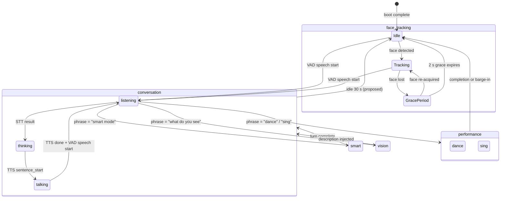

# Modes & LED Contract

One-page reference for every behavioural mode Dotty has, what colour the ring shows, and how a mode hands off to the next. Pair this with [interaction-map.md](./interaction-map.md) (which catalogs the underlying signals) and [hardware.md](./hardware.md) (which catalogs the physical LED ring + servos).

## TL;DR

- Dotty has four mode **tiers**: ambient (idle), conversation (talking), performance (one-shot action), maintenance (config / OTA).
- The 12-LED WS2812 ring on the front panel is the primary feedback channel. Two control paths drive it: **firmware-automatic** (reacts to device state) and **server-overridable** (MCP `set_led_color`).
- Most mode transitions are voice-phrase triggered today. Face-tracking is firmware-resident; dance / sing / smart / vision are dispatched server-side from `receiveAudioHandle.py`.
- One behaviour is **designed but not yet implemented**: face-detected auto-listen (face → 5 s manual-listen window → fall back to face-tracking). See [Designed but not yet implemented](#designed-but-not-yet-implemented) below.
- **Hybrid smart-mode LED is live** (bridge commit `b72b121`, firmware `32163bd`): LED index 0 holds purple throughout the smart-mode turn; remaining 11 LEDs continue showing listen / think / talk colours.

## Mode tiers

```
Ambient        face_tracking          (default; no user intent yet)
               sleep                   (deferred — see Future modes)

Conversation   listening
               thinking                 sub-states of one conversation,
               talking                  owned by xiaozhi-server
               smart                   (capable-model variant)

Performance   dance / sing             (rainbow timeline + choreography)
               vision                  (camera capture + describe)

Maintenance   wifi_configuring
               connecting              firmware-driven during boot / OTA
               upgrading
               activating
```

## Per-mode reference

| Mode | Tier | Triggered by | LED today | Lives in |
|---|---|---|---|---|
| `face_tracking` | ambient | firmware face-detect (Idle ↔ Tracking ↔ GracePeriod) | left LED green when face seen, ring otherwise off (FadeOut) | `firmware/firmware/main/stackchan/modifiers/face_tracking.cpp` |
| `listening` | conversation | xiaozhi VAD detects speech start | ring solid red `(32,0,0)` | `firmware/firmware/xiaozhi-esp32/main/led/circular_strip.cc` |
| `thinking` | conversation | STT frame received (ASR result emitted) | ring solid orange (firmware-side) | firmware (triggered server-side via `llm` emotion frame) |
| `talking` | conversation | TTS `sentence_start` event | ring solid green `(0,32,0)` | `firmware/firmware/xiaozhi-esp32/main/led/circular_strip.cc` |
| `smart` | conversation | voice phrase: `"smart mode"`, `"think harder"`, `"big brain"` | one-shot purple `(168,0,168)` flash on entry, then normal listen / think / talk | `receiveAudioHandle.py` (smart-mode dispatch) + `bridge.py` (`SMART_MODEL` routing) |
| `vision` | performance | voice phrase: `"what do you see"`, `"take a photo"`, `"describe what"` | none distinct (uses normal speech LEDs) | `receiveAudioHandle.py` (`_handle_vision`) + `bridge.py` (`/api/vision/*`) |
| `dance` / `sing` | performance | voice phrase: `"dance"`, `"sing"`, song-name (`"macarena"`, `"tetris"`, `"star wars"`, …) | timeline-driven multi-colour rainbow (see [Dance & sing](#dance--sing)) | `receiveAudioHandle.py` (`_handle_dance`) + `dances.py` |
| `wifi_configuring` | maintenance | first boot, no creds | blue blink, 500 ms | `firmware/firmware/xiaozhi-esp32/main/led/circular_strip.cc` |
| `connecting` | maintenance | post-boot, joining WiFi/WS | solid blue (low-brightness) | same |
| `upgrading` | maintenance | OTA in progress | green blink, 100 ms | same |
| `activating` | maintenance | provisioning code entry | green blink, 500 ms | same |

### face_tracking

Three-state firmware modifier (`face_tracking.cpp`):

- **Idle** — no face seen. Idle motion runs (random head looks every 4–8 s). Left LED off.
- **Tracking** — face detected. Idle motion paused. Head smoothly follows normalised bbox via `motion().lookAtNormalized()`. Left LED green `(0,168,0)`.
- **GracePeriod** — face just lost. 2 s window where re-acquisition snaps back to Tracking. After 2 s, returns to Idle.

The Tracking ↔ GracePeriod ↔ Idle loop is **entirely firmware-resident**. The server-side Python pipeline does not know whether a face is currently visible. This is the gap the [face-detected auto-listen](#face-detected-auto-listen-deferred) design closes.

### listening / thinking / talking

These are sub-states of a single conversation turn. Driven from xiaozhi-server, signalled to the firmware via the existing event protocol (`stt`, `llm`, `tts/start`, `tts/sentence_start`). The firmware drives LEDs from device-state changes via `CircularStrip::OnStateChanged()`. See [interaction-map.md](./interaction-map.md) for the per-event signal table.

### smart

Capable-model variant of conversation. Triggered by phrase match in `receiveAudioHandle.py` against `_SMART_MODE_PHRASES`. Two activation paths:

- **One-shot**: `"smart mode, what is the speed of light?"` → trigger phrase + remaining query routed to the capable model in a single turn.
- **Two-turn**: `"smart mode."` (no query) → robot acknowledges (`"Smart mode! What would you like to know?"`), `conn.smart_mode_next = True` flag set; the next turn is forced through smart routing.

The capable model is configured via `SMART_MODEL` env on the bridge (e.g. Claude Sonnet via OpenRouter); falls through to the default brain if unset. LED: on smart-mode entry `set_led_color(168,0,168)` pulses the ring, then `conn.smart_mode_active = True` is set; subsequently `_send_led_color` re-asserts pixel `SMART_MODE_LED_INDEX` (default 0) purple via `set_led_multi` after every full-ring state change, so the indicator persists until the turn completes (flash-pending: firmware `32163bd`).

### vision

Camera-driven multimodal turn. Phrase match against `VISION_PHRASES` triggers an MCP `tools/call` for `self.camera.take_photo`, then long-polls the bridge's `/api/vision/latest/<device_id>` for the description. Description is injected as context into the next ZeroClaw prompt; LLM responds naturally as if looking at the photo.

### dance / sing

Unified handler — both phrases route through `_handle_dance()`. Behaviour:

1. Phrase match → registry lookup in `DANCE_REGISTRY` (`dances.py`).
2. If preset has a renderable `audio_file` (`.mid` / `.wav`): render to Opus and stream into the TTS queue while a parallel asyncio task walks the choreography timeline (servo `HEAD` events + `LED` events).
3. If no audio: prompt the LLM for a spoken intro and run choreography only.

Six choreographies ship today, all in `dances.py`:

| Choreography | LED feel | Used by |
|---|---|---|
| `macarena_moves` | hand-tuned 14-event timeline (purple / red / blue / green / yellow / cyan / orange / white) | `macarena` |
| `head_bob` | steady cool blue `(0, 80, 168)` | (none currently) |
| `color_party` | rainbow palette, colour change every 2 beats | `mario` |
| `bouncy_party` | rainbow palette, colour change every beat (faster) | `tetris`, `pirates` |
| `sleepy_sway` | warm dim `(100, 40, 0)`, gentle sway | (none currently) |
| `look_around` | deep blue / white pulses, dramatic poses | `mountain_king`, `star_wars` |

The shared rainbow palette (`_RAINBOW` in `dances.py`) is 8 colours: red, orange, yellow, green, cyan, blue, violet, magenta. New songs slot in by adding an entry to `DANCE_REGISTRY` and (if needed) a new choreography factory in `CHOREOGRAPHIES`.

## State transition diagram



The `face_tracking → listening` edge currently fires only when the user speaks (VAD trips). With [face-detected auto-listen](#face-detected-auto-listen-deferred), that edge would also fire briefly when a face is acquired, opening a 5 s manual-listen window before falling back to face-tracking.

## LED contract

| Mode | Resting LED | Transition cue |
|---|---|---|
| `face_tracking` idle | ring off (FadeOut) | — |
| `face_tracking` active | left LED green; ring breathing low-green *(proposed)* | brief breathe-up on face acquire *(proposed)* |
| `listening` | ring solid red `(32,0,0)` | — |
| `thinking` | ring solid orange | — |
| `talking` | ring solid green `(0,32,0)` | — |
| `smart` (active turn) | one ring LED held purple `(168,0,168)`; remaining 11 LEDs continue listen / think / talk *(proposed)* | purple pulse on entry; held LED clears on exit |
| `vision` | brief cyan flash on capture *(proposed)* | restores prior mode's LED after capture |
| `dance` / `sing` | timeline rainbow (choreography-driven) | — |
| `sleep` *(deferred)* | all off | brief fade-out on entry |
| `wifi_configuring` | blue blink, 500 ms | — |
| `connecting` | solid blue, low-brightness | — |
| `upgrading` | green blink, 100 ms | — |
| `activating` | green blink, 500 ms | — |

### LED control surfaces

- **Firmware-automatic** — `CircularStrip::OnStateChanged()` (`firmware/firmware/xiaozhi-esp32/main/led/circular_strip.cc`) maps device state → solid / blink / scroll patterns. Triggered by the firmware's own `kDeviceState*` enum changes.
- **Server-overridable** — two MCP tools invoked via helpers in `receiveAudioHandle.py`:
  - `self.robot.set_led_color(r, g, b)` → `_send_led_color()`: paints the full 12-LED ring one colour; used for smart-mode entry pulse and dance timeline events. Overrides firmware-automatic LED until the next firmware state change.
  - `self.robot.set_led_multi(index, r, g, b)` → `_send_led_multi()` (firmware ≥ `32163bd`): sets a **single** pixel without disturbing the rest. Bypasses the colour-animation tick, so it persists across firmware state changes that use `SetAllColor`. Used by the hybrid smart-mode indicator (re-asserted after each `_send_led_color` call when `conn.smart_mode_active` is True). Degrades gracefully on older firmware.

### Available LED primitives

Firmware `CircularStrip` (`circular_strip.h`) exposes: `SetAllColor`, `SetSingleColor`, `SetMultiColors`, `Blink(color, interval_ms)`, `Breathe(low, high, interval_ms)`, `Scroll(low, high, length, interval_ms)`, `Rainbow(low, high, interval_ms)`, `FadeOut(interval_ms)`. Brightness is `DEFAULT_BRIGHTNESS = 32`, `LOW_BRIGHTNESS = 4` (0–255 scale).

The `set_led_multi` MCP tool (firmware `32163bd`) wraps `setColorAt()` on the `NeonLight` objects (index 0–5 → LeftNeonLight, 6–11 → RightNeonLight). Note: `setColorAt()` is a per-pixel write that bypasses `_color_anim`, which is why re-assertion is needed after full-ring colour changes.

Anything we want to design fits inside this primitive set.

## Designed but not yet implemented

### Face-detected auto-listen (deferred)

**Problem.** Face tracking detects a face and turns the left LED green, but the event never reaches the Python side. The user has to speak first to engage a conversation. Walking up and waiting at the robot does nothing.

**Design.**

```
[face_tracking idle] ──face detected──▶ [face_tracking active, LED green]
                                          │
                                          ├─ speech heard within 5 s ─▶ [listening] (normal flow)
                                          │
                                          └─ 5 s of silence ─────────▶ stay in [face_tracking active]

[face_tracking active] ──face lost > 2 s grace──▶ [face_tracking idle]
```

**Implementation sketch** (deferred to a follow-up task):

1. **Firmware** (`face_tracking.cpp` Idle → Tracking edge): emit a server-bound event, e.g. `{"type":"event","name":"face_detected"}`, via the same outbound JSON channel used for `listen` / `abort` frames.
2. **Server** (`receiveAudioHandle.py`): on `face_detected`, send `{"type":"listen","state":"start","mode":"manual"}` to the device, start a 5 s timer. If VAD trips within the window → normal conversation flow takes over. If timer expires without VAD → send `{"type":"listen","state":"stop"}` and remain in face-tracking.

**Why it's deferred.** This requires firmware changes (new outbound event) which mean an OTA reflash. Captured here so the design is durable; implementation tracked in [`ROADMAP.md`](../ROADMAP.md).

### Hybrid smart-mode LED (shipped)

**Shipped** in bridge commit `b72b121` (firmware half: StackChan/dotty `32163bd`, **flash pending**).

**Behaviour.** On smart-mode entry, `conn.smart_mode_active = True` is set on the `ConnectionHandler`. `_send_led_color()` then re-asserts pixel `SMART_MODE_LED_INDEX` (env var, default `0`) at purple `(168,0,168)` via `_send_led_multi()` after every full-ring colour change. The remaining 11 LEDs continue to show the firmware-automatic listen / think / talk colours. On turn completion `smart_mode_active` is cleared; the ring returns to firmware-automatic behaviour.

**Firmware prerequisite.** The `self.robot.set_led_multi(index, r, g, b)` MCP tool was added in StackChan/dotty `32163bd`. Without that firmware, the bridge degrades to the previous single-flash behaviour (warn-once per connection).

## Future modes

These are documented as design-space placeholders so contributors know where they would slot in. None are scheduled today.

| Mode | Tier | Resting LED (proposed) | Notes |
|---|---|---|---|
| `sleep` | ambient | all off; display dim | Manual toggle now; later schedule-driven (quiet hours). Wake on wake-word or portal toggle. |
| `greeting` | conversation | brief warm flash on entry | Proactive on recognised face. Per-person, per-day cooldown; time-of-day-aware tone. Roadmap-only. |
| `privacy` / `mute` | ambient | solid red (one LED, low-brightness) | Mic + camera disabled; hardware-guaranteed indicator. Prerequisite for always-on face detection. |
| `story_time` | conversation | dimmed warm `(100, 40, 0)` | Longer-form narration, no sentence truncation, lower TTS rate. |
| `game` | performance | mode-specific palette | Turn-based interactions (rock-paper-scissors, Simon Says). |

See [`ROADMAP.md`](../ROADMAP.md) for current priority on each.

## See also

- [interaction-map.md](./interaction-map.md) — every cross-layer signal (audio, LLM, MCP, session control); the wire-level companion to this doc.
- [hardware.md](./hardware.md) — physical LED ring spec, servo capabilities, MCP tool catalog.
- [voice-pipeline.md](./voice-pipeline.md) — how listening / thinking / talking sub-states map to xiaozhi-server internals.
- [kid-mode.md](./kid-mode.md) — how Kid Mode wraps every conversation mode (default-on safety guardrails, prompt suffix injection).
- [latent-capabilities.md](./latent-capabilities.md) — upstream features we aren't yet using; some of these would land as new modes.

Last verified: 2026-04-25. Updated 2026-04-25 (hybrid smart-mode LED shipped, SetMultiColors→set_led_multi correction).
